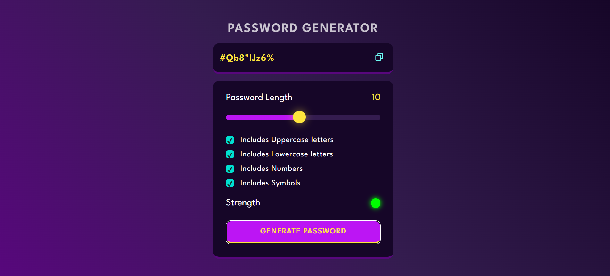

# 🔐 Password Generator

A modern and responsive **password generator web app** built using HTML, CSS, and JavaScript.
It allows users to generate strong, secure passwords instantly and evaluate their strength in real time.

---

## 🌐 Live Demo

👉 https://mdezajansari.github.io/Password-Generator/

---

## 📸 Screenshot



---

## 🚀 Features

* Generate strong random passwords
* Visual password strength indicator

  * 🔴 Red = Weak password
  * 🟡 Yellow = Medium password
  * 🟢 Green = Strong password
* Clean and responsive UI
* One-click copy to clipboard
* Adjustable password settings (length, characters, etc.)
* Lightweight and fast (no dependencies)

---

## 🛠️ Tech Stack

* **HTML5** – Structure
* **CSS3** – Styling and layout
* **JavaScript (Vanilla)** – Logic and functionality

---

## 📂 Project Structure

```id="0d1h5m"
password-generator/
│── index.html
│── style.css
│── script.js
│── img/
│    └── copy.svg
```

---

## ⚙️ How It Works

1. Select password criteria (length, uppercase, numbers, symbols, etc.)
2. Click the generate button
3. Instantly view password strength:

   * Weak (Red)
   * Medium (Yellow)
   * Strong (Green)
4. Copy the password using the copy icon

---

## 🧑‍💻 Installation & Usage

1. Clone the repository:

   ```bash
   git clone https://github.com/your-username/securepass-gen.git
   ```

2. Navigate into the project folder:

   ```bash
   cd securepass-gen
   ```

3. Run the project:

   * Open `index.html` in your browser

---

## 💡 Future Improvements

* Add animated strength meter (progress bar)
* Dark / Light mode toggle
* Save generated passwords locally
* Password history feature
* Mobile UI enhancements

---

## 🤝 Contributing

Contributions are welcome!
Feel free to fork the repository and submit a pull request.

---

## 📄 License

This project is open-source and available under the MIT License.
